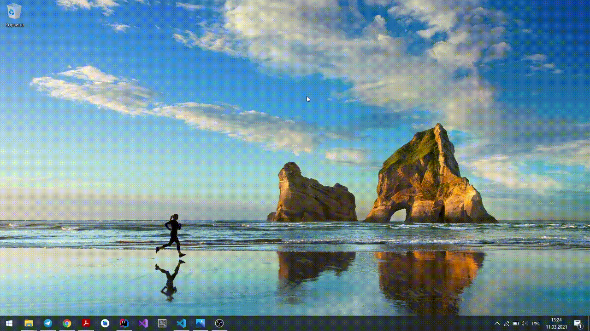

# Лабораторная работа 2
## Малявко Александра, 3 курс, 12 группа

Приложение считывает из графического файла/файлов основную информацию об изображении.
Чтобы отобразить информацию, необходимо выбрать папку (кнопка **Choose directory**). После выбора папки будет выведена таблица со следующей информацией о файлах: 
- имя файла;
- размер изображения (в пикселях);
- разрешение (dot/inch);
- глубина цвета;
- сжатие (для тех типов файлов, в которых оно может быть задано).
Также в указанной папке будет создан текстовый файл `ImageInfo.txt`, в котором будет содержаться вся информация, которую возможно получить о файлах посредством [используемой библиотеки](https://github.com/drewnoakes/metadata-extractor). 
